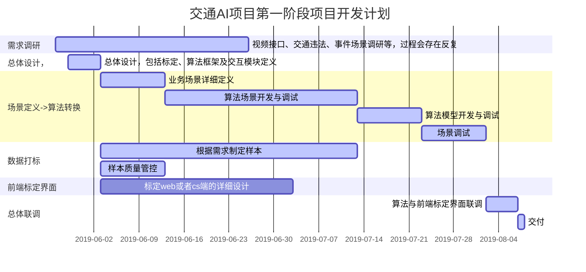

`交通AI项目第一阶段项目开发计划`

`section 需求调研       `

`
视频接口、交通违法、事件场景调研等，过程会存在反复:active,p1, 2019-05-27, 20d`

`section 总体设计，`

`总体设计，包括标定、算法框架及交互模块定义          :active,p2, 2019-05-29, 5d`

`section 场景定义->算法转换`

`业务场景详细定义     : active,p3,after p2,10d`

`算法场景开发与调试        : active,p4,after p3,30d`

`算法模型开发与调试          : active,p5,after p4,10d`

`场景调试 					 : active,p6,after p5,10d`

`section 数据打标`

`根据需求制定样本 :active,p7,after p2,40d`

`样本质量管控 :active,p8,after p2,10d`

`section 前端标定界面`

`标定web或者cs端的详细设计            :       p9, after p2, 30d`

`section 总体联调` 

`算法与前端标定界面联调 :active,p10,after p6,5d`

`交付 :active ,p11,after p10,1d`